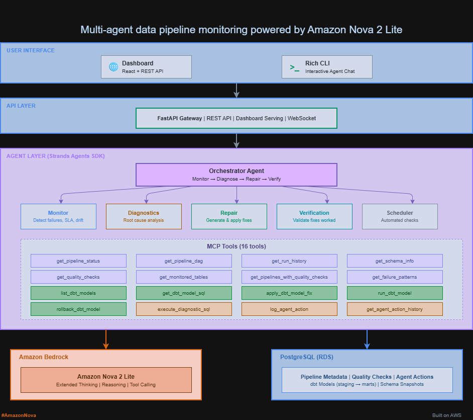

# Agentic Pipeline Repair

[](https://www.python.org/downloads/)
[](https://aws.amazon.com/bedrock/)
[](https://aws.amazon.com/bedrock/)
[](https://github.com/strands-agents/sdk-python)
[](https://fastapi.tiangolo.com/)
[](https://www.postgresql.org/)
[](https://www.getdbt.com/)
[](https://www.docker.com/)
[](https://react.dev/)
[](https://opensource.org/licenses/MIT)

An autonomous multi-agent system that monitors, diagnoses, and repairs data pipeline failures using Amazon Nova 2 Lite's extended reasoning capabilities on Amazon Bedrock.

**Amazon Nova AI Hackathon 2026 | Category: Agentic AI**

## How It Works

A single `check` command triggers a multi-agent workflow that automatically detects failures, traces root causes through the pipeline DAG, reads actual dbt model SQL, and proposes exact code fixes with human-in-the-loop approval.

1. **Monitor Agent** scans all pipelines for failures, SLA breaches, schema drift, and data quality violations. Dynamically discovers what to check from the database at runtime.

2. **Diagnostics Agent** uses Nova 2 Lite's extended thinking (high intensity) for root cause analysis. Traces the pipeline DAG upstream, reads dbt model SQL, runs diagnostic queries, and checks historical failure patterns to identify recurring issues.

3. **Repair Agent** reads actual dbt model source code, generates fix proposals with before/after diffs, and can auto-apply fixes to dbt model files with human approval. Automatically runs dbt to verify the fix compiles, and rolls back if it fails.

4. **Verification Agent** validates that applied fixes actually resolved the issue by checking pipeline status, running quality checks, and comparing before/after metrics.

5. **Orchestrator Agent** coordinates the full Monitor -> Diagnose -> Repair -> Verify workflow. Provides both an interactive CLI and a REST API.

6. **Scheduler** runs automated health checks at configurable intervals as a background process.

## Architecture



## Dashboard

The React dashboard provides real-time visibility into pipeline health with the DAG topology showing color-coded status for each pipeline stage (Source, Staging, Marts). Auto-refreshes every 10 seconds with a manual refresh button.

## Agent Tools (16 total)

The agents interact with pipeline infrastructure through these tools:

| Tool | Description |
|------|-------------|
| `get_pipeline_status` | Current state of all pipelines with SLA tracking |
| `get_pipeline_dag` | Dependency graph (upstream/downstream) for any pipeline |
| `get_run_history` | Recent run history with status, duration, errors |
| `get_schema_info` | Table schemas with drift detection against snapshots |
| `get_quality_checks` | Data quality check definitions and latest results |
| `list_dbt_models` | Discover all dbt models in the project with categories |
| `get_dbt_model_sql` | Read actual dbt model SQL to understand and propose fixes |
| `get_monitored_tables` | Dynamically discover all tables tracked for schema drift |
| `get_pipelines_with_quality_checks` | Dynamically discover pipelines with quality checks |
| `apply_dbt_model_fix` | Write updated SQL to dbt model files (with backup) |
| `run_dbt_model` | Run dbt to compile and verify a fix |
| `rollback_dbt_model` | Revert a dbt model to its backup if fix fails |
| `execute_diagnostic_sql` | Run read-only SQL queries for investigation |
| `log_agent_action` | Record agent actions for audit trail |
| `get_agent_action_history` | Query past agent actions for pattern analysis |
| `get_failure_patterns` | Analyze recurring failures across pipelines |

Agents discover what to monitor at runtime using `get_monitored_tables` and `get_pipelines_with_quality_checks`, making the system work with any dataset without code changes.

## Quick Start

### Prerequisites
- Docker and Docker Compose
- Python 3.11+
- AWS CLI configured with Bedrock access (`AmazonBedrockFullAccess` policy)

### 1. Clone and configure
```bash
git clone https://github.com/sanidhya-karnik/agentic-pipeline-repair.git
cd agentic-pipeline-repair
cp .env.example .env
# Edit .env with your AWS credentials and region
```

### 2. Start PostgreSQL
```bash
docker compose up -d postgres
```
This automatically creates the database schema, seeds synthetic e-commerce data (50 customers, 500 orders, 20 products), and populates pipeline metadata (10 pipelines with DAG dependencies, quality checks, and run history).

### 3. Install Python dependencies
```bash
python -m venv .venv
source .venv/bin/activate  # Linux/Mac
# .venv\Scripts\activate   # Windows
pip install -r requirements.txt
```

### 4. Initialize dbt models
```bash
cd dbt_project
dbt run --profiles-dir .
cd ..
```

### 5. Start the dashboard and API
```bash
uvicorn src.api.main:app --reload --port 8000
```
Open http://localhost:8000 for the dashboard, or http://localhost:8000/docs for the API documentation.

### 6. Run the interactive CLI agent
```bash
# Rich CLI (recommended for demos)
python -m src.agents.rich_cli

# Standard CLI
python -m src.agents.orchestrator
```
Type `check` for a full health scan, or ask natural language questions like:
- "Why did mart_revenue_daily fail?"
- "Check data quality for stg_orders"
- "Read the stg_orders dbt model and propose the exact fix needed"

## Demo Scenarios

Inject simulated failures to demonstrate the agents in action:

```bash
# Scenario 1: Upstream schema change breaks downstream pipelines
python -m demo.inject_failure --scenario schema_drift

# Scenario 2: Null spike in a critical field (15% vs 5% threshold)
python -m demo.inject_failure --scenario data_quality

# Scenario 3: Pipeline stuck running 3x over SLA
python -m demo.inject_failure --scenario sla_breach

# Inject all three at once
python -m demo.inject_failure --scenario all

# Reset to clean state (full reset including schema)
python -m demo.inject_failure --scenario reset

# Quick cleanup (clear failures, keep schema)
python -m demo.cleanup
```

## Cloud Deployment

The project can be deployed to AWS using RDS PostgreSQL and EC2.


See [deploy/DEPLOY.md](deploy/DEPLOY.md) for full instructions.

## Project Structure

```
agentic-pipeline-repair/
├── README.md
├── docker-compose.yml
├── .env.example
├── requirements.txt
├── src/
│   ├── agents/
│   │   ├── monitor.py        # Detects pipeline issues
│   │   ├── diagnostics.py    # Root cause analysis with extended thinking
│   │   ├── repair.py         # Generates and auto-applies fixes to dbt models
│   │   ├── verification.py   # Validates fixes resolved the issue
│   │   ├── scheduler.py      # Automated health checks on a schedule
│   │   ├── orchestrator.py   # Coordinates 5 agents, interactive CLI
│   │   └── rich_cli.py       # Rich terminal UI for demos
│   ├── mcp_server/
│   │   └── tools.py          # 16 MCP tools for pipeline interaction
│   ├── api/
│   │   └── main.py           # FastAPI REST endpoints + dashboard
│   └── config/
│       ├── settings.py       # Environment-based configuration
│       └── db.py             # PostgreSQL query utilities
├── dashboard/
│   └── index.html            # React dashboard (pipeline DAG, agent feed, chat)
├── dbt_project/
│   ├── dbt_project.yml       # dbt configuration
│   ├── profiles.yml          # Database connection profile
│   └── models/
│       ├── staging/          # Staging models (stg_customers, stg_orders, etc.)
│       └── marts/            # Mart models (customer_orders, revenue, product perf.)
├── docs/
│   ├── agentic-pipeline-repair.drawio  # Architecture diagram (editable)
│   ├── agentic-pipeline-repair.png     # Architecture diagram (image)
│   ├── aws-cloud-architecture.drawio   # AWS deployment diagram (editable)
│   └── aws-cloud-architecture.png      # AWS deployment diagram (image)
├── deploy/
│   ├── DEPLOY.md             # Cloud deployment guide
│   ├── setup_aws.sh          # Automated AWS setup script
│   ├── teardown_aws.sh       # Resource cleanup script
│   └── ec2_configure.sh      # EC2 instance configuration
├── data/
│   └── sql/
│       └── init.sql          # Database schema + seed data
└── demo/
    ├── inject_failure.py     # Demo scenario injection scripts
    └── cleanup.py            # Quick cleanup utility
```

## API Endpoints

| Method | Endpoint | Description |
|--------|----------|-------------|
| GET | / | React dashboard |
| GET | /health | App health check |
| GET | /pipelines | List all pipelines with status |
| GET | /pipelines/{name} | Pipeline detail with run history |
| POST | /check | Trigger full health check |
| POST | /diagnose | Diagnose a specific alert |
| POST | /repair | Get fix proposal for a diagnosis |
| POST | /chat | Interactive chat with orchestrator |
| GET | /actions | Recent agent actions log |
| POST | /verify | Verify a fix resolved the issue |
| POST | /scheduler/start | Start automated health checks |
| POST | /scheduler/stop | Stop automated health checks |
| GET | /scheduler/status | Get scheduler status |
| GET | /patterns | Historical failure patterns |
